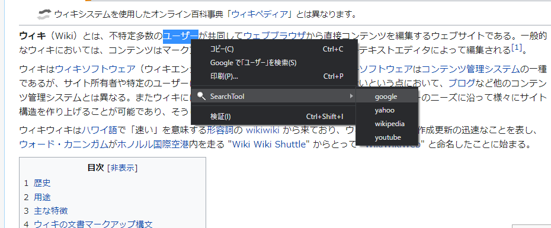

# 1-Click検索
Google Extensions

### 内容
Web上で選択して検索する際、検索先を複数設定できるChrome拡張

オプション画面からURLを追加する

### 出来ること
自分で、選択したワードを任意のサイトで検索できるようになります。

### 拡張機能の導入方法

1. Clone or downloadをして保存。
1. ダウンロードした.zipフォルダを解凍。
1. chromeを開き、右上の...をクリックする。
1. 「その他のツール」から、「拡張機能」をクリック。
1. 「デベロッパーモード」をオンにする。
1. 「パッケージ化されていない拡張機能を読み込む」をクリック。
1. 解凍したフォルダを選択。

### 使い方

1. 導入した拡張機能をクリックし、「オプション」をクリック。
1. 各項目を設定する。
  - 「タイトル」    ... 選択する時に出てくる項目の名前。
    - 例) Google
  - 「クエリ」      ... URLを指定する。
    - `{{}}`と記述すると、そこに選択した単語が置換されます。
    - 例) `https://google.com/search?q={{}}`
